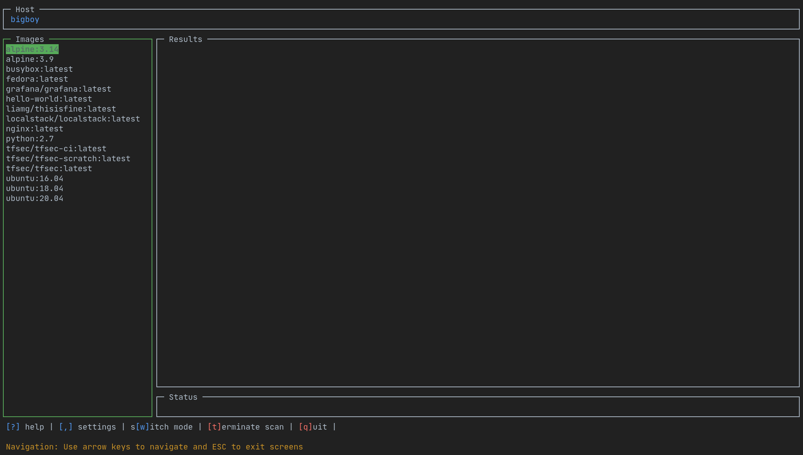

[](https://goreportcard.com/report/github.com/owenrumney/lazytrivy)
[](https://github.com/owenrumney/lazytrivy/blob/master/LICENSE)
[](https://github.com/owenrumney/lazytrivy/releases)
[](https://github.com/owenrumney/lazytrivy/releases)

# lazytrivy

lazytrivy is a wrapper for [Trivy](https://github.com/aquasecurity/trivy) that allows you to run Trivy without
remembering the command arguments.

The idea was very heavily inspired by the superb tools from [Jesse Duffield](https://github.com/jesseduffield) (
lazydocker, lazynpm, lazygit)


## Features

- Image Scanning
  - [Scan all images on your system](#scanning-all-local-images)
  - [Scan a single image](#scanning-a-specific-image)
  - [Scan a remote image](#scanning-a-remote-image)
- AWS Scanning
  - [Scan your cloud account](#scanning-an-aws-account)
- File System Scanning
  - [Scan a filesystem for vulnerabilities and misconfigurations](#scanning-a-filesystem)

## What does it do

lazytrivy will run Trivy in a docker container and display the results in a terminal UI, the intention is that this will make it more stable across all platforms.

When running a Filesystem scan, lazytrivy will mount the target dir in the container and run Trivy against it.

Trivy intermittently downloads the latest DB - while lazytrivy maintains a cache, if you experience a delay in the scanning of an image or filesystem, it is likely trivy is running a download.

If you're interested in seeing what's happening behind the scenes in Docker, I'd thoroughly recommend using [LazyDocker](https://github.com/jesseduffield/lazydocker).


## Installation

### Prerequisites

In order for lazytrivy to be cross-platform, it uses the Trivy docker image. This means that you will need to have Docker running on your machine for lazytrivy to work.

#### Install with Go

The quickest way to install if you have `Go` installed is to get the latest with `go install`

```bash
go install github.com/owenrumney/lazytrivy@latest
```

#### Download from Releases

Alternatively, you can get the latest releases from [GitHub](https://github.com/owenrumney/lazytrivy)

### Config

A config file can be added to `~/.config/lazytrivy/config.yml` to set default options.

```yaml
aws:
  accountno: "464897523927"
  region: us-east-1
vulnerability:
  ignoreunfixed: false
filesystem:
  scansecrets: true
  scanmisconfiguration: true
  scanvulnerabilities: true
cachedirectory: ~/.cache
debug: true
trace: false

```
#### Config via UI

Settings can be adjusted via the UI by pressing the `,` key at any time. 



By setting `debug` to true, additional logs will be generated in `/tmp/lazytrivy.log`

## Usage

`lazytrivy` is super easy to use, just run it with the following command:

```bash
lazytrivy --help           

Usage:
  lazytrivy [command]

Available Commands:
  aws         Launch lazytrivy in aws scanning mode
  filesystem  Launch lazytrivy in filesystem scanning mode
  help        Help about any command
  image       Launch lazytrivy in image scanning mode

Flags:
      --debug                Launch with debug logging
      --docker-host string   Docker host to connect to (default "unix:///var/run/docker.sock")
  -h, --help                 help for lazytrivy
      --trace                Launch with trace logging

Use "lazytrivy [command] --help" for more information about a command.

```

### Viewing logs

Logs are generated in `$HOME/.lazytrivy/logs/lazytrivy.log` with the default level at `info`. You can change the log level by setting the `--debug` flag.

To get even more information (more than you need), you can set the `--trace` flag. This will generate a lot of logs, so be careful and most of it is for tracking the position of the cursor, Docker events etc.

### Setting the docker host

By default, lazytrivy will connect to the docker daemon on the local machine by looking at the current context.

The default docker host is `unix:///var/run/docker.sock`. If you are running Docker on a remote host, you can set the docker host with the `--docker-host` flag.

```bash

### Starting in a specific mode

You can start `lazytrivy` in a specific mode using `aws`, `images` or `filesystem`:

For example, to scan a specific filesystem folder, you could run:

```bash
lazytrivy fs --path /home/owen/code/github/owenrumney/example
```

This will start in filesystem mode pointing to the specified path. If no path is provided it will point to the current working directory.


### Scanning all local images

Pressing `a` will scan all the images that are shown in the left hand pane. On completion, you will be shown a
summary of any vulnerabilities found.

You can then scan individual images to get more details


### Scanning a specific image

Select an image from the left hand pane and press `s` to scan it. Use the left and right arrow keys to switch between
views and up down arrow keys to select an image.

Press `s` to scan the currently selected image.


### Scanning a remote image

To scan an image that is not already locally on the machine, you can use the `r` key to scan a remote image.


### Scanning an AWS Account

To scan an AWS account, you can use the `w` key to switch to AWS mode, from there you can use the `s` key to scan, it will detect any valid credentials it can.


By pressing `r` you can switch region in results you already have.

### Scanning a filesystem

To scan a filessystem, you can use the `w` key to switch to Filesystem mode, from there you will get all the vulnerabilities, misconfigurations and secrets from the current working directory


