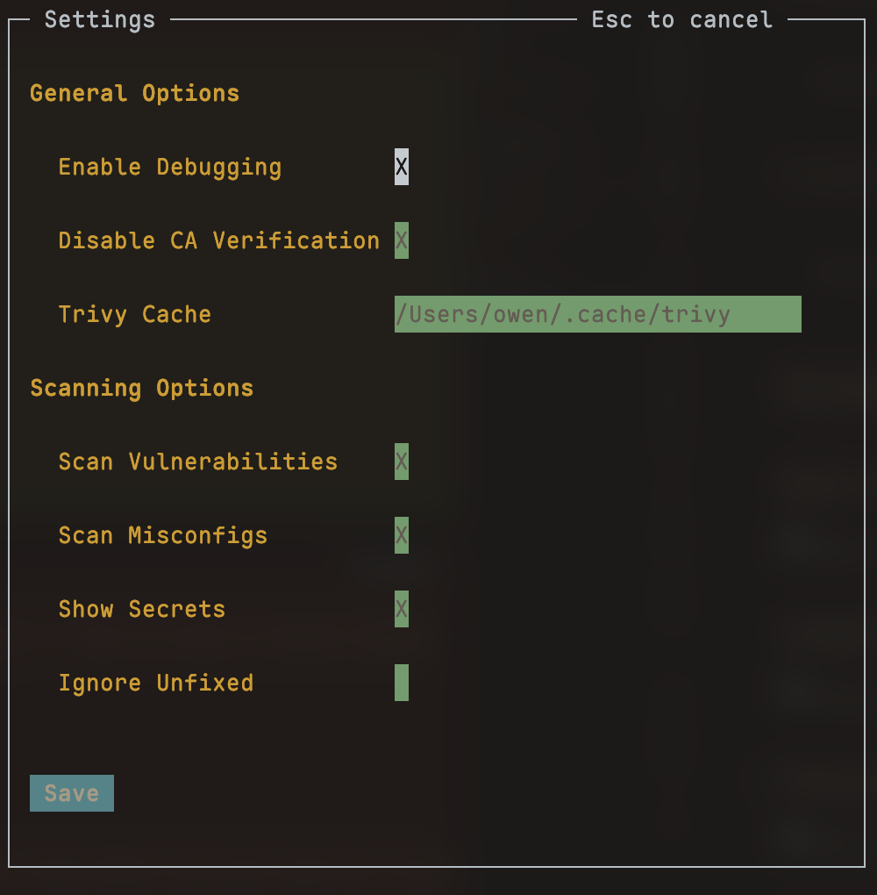
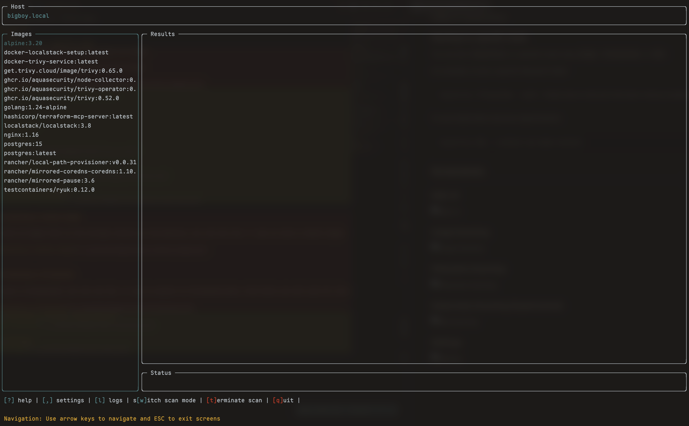
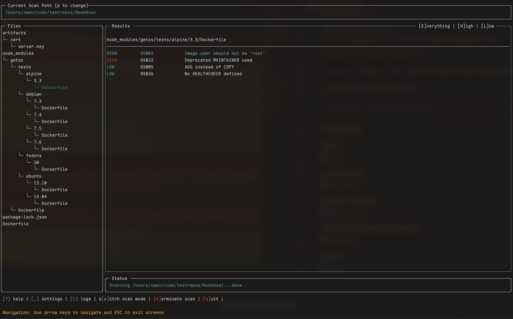
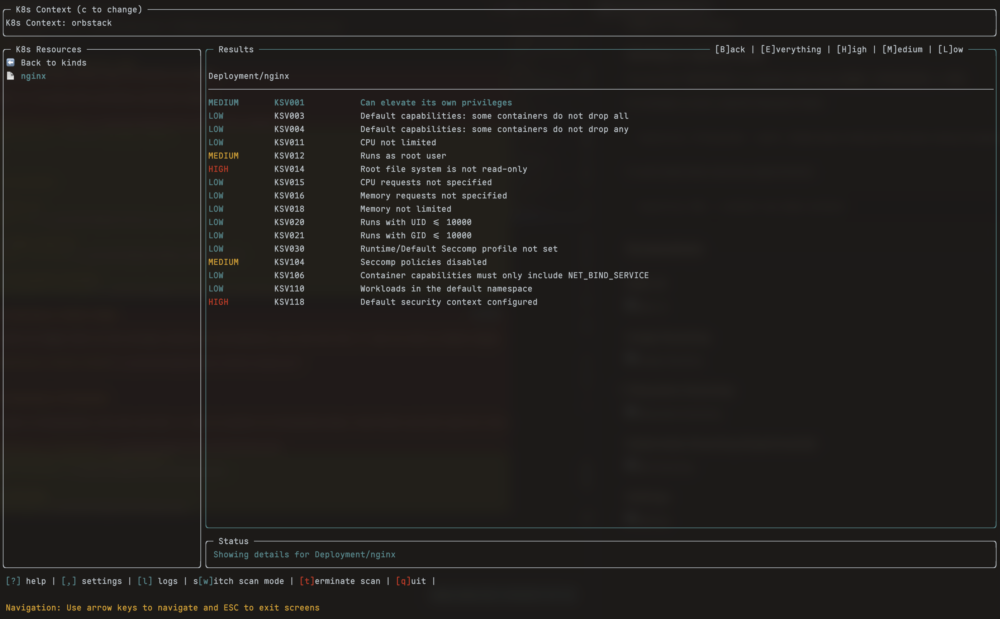

[](https://goreportcard.com/report/github.com/owenrumney/lazytrivy)
[](https://github.com/owenrumney/lazytrivy/blob/master/LICENSE)
[](https://github.com/owenrumney/lazytrivy/releases)
[](https://github.com/owenrumney/lazytrivy/releases)

# lazytrivy


lazytrivy is a terminal UI wrapper for [Trivy](https://github.com/aquasecurity/trivy) that lets you run Trivy scans without remembering all the command arguments. It now uses the latest Trivy binary directly (no Docker image required).


Inspired by [Jesse Duffield](https://github.com/jesseduffield)'s superb tools (lazydocker, lazynpm, lazygit).


## Features

- **Image Scanning**
  - Scan all images on your system
  - Scan a single image
  - Scan a remote image
- **File System Scanning**
  - Scan a filesystem for vulnerabilities, misconfigurations, and secrets
- **Kubernetes Scanning (Experimental)**
  - Scan K8s resources for vulnerabilities and misconfigurations *(experimental, subject to user feedback)*


## What does it do?

lazytrivy provides a fast, interactive terminal UI for running Trivy scans. It displays results in a clear, navigable interface and helps you select images, filesystems, or Kubernetes resources to scan. Trivy is run directly (no Docker required), so you always get the latest features and performance.

Trivy will periodically download the latest vulnerability database. lazytrivy maintains a cache, but if you experience a delay, it's likely Trivy is updating its DB.


## Installation


#### Install with Go

If you have Go installed:

```bash
go install github.com/owenrumney/lazytrivy@latest
```

#### Download from Releases

Get the latest releases from [GitHub](https://github.com/owenrumney/lazytrivy/releases)


### Config

Optionally, add a config file at `~/.config/lazytrivy/config.yml`:

```yaml
vulnerability:
  ignoreunfixed: false
filesystem:
  scansecrets: true
  scanmisconfiguration: true
  scanvulnerabilities: true
cachedirectory: ~/.cache
debug: true
trace: false
```

#### Config via UI

Settings can be adjusted via the UI by pressing the `,` key at any time.



By setting `debug` to true, additional logs will be generated in `/tmp/lazytrivy.log`


## Usage

`lazytrivy` is easy to use. Run it with:

```bash
lazytrivy --help
```

Available Commands:
- `image`       Launch lazytrivy in image scanning mode
- `filesystem`  Launch lazytrivy in filesystem scanning mode
- `k8s`         Launch lazytrivy in Kubernetes scanning mode *(experimental)*
- `help`        Help about any command

Flags:
- `--debug`     Launch with debug logging
- `--trace`     Launch with trace logging

Use `lazytrivy [command] --help` for more information about a command.


### Viewing logs

Logs are generated in `$HOME/.lazytrivy/logs/lazytrivy.log` (default level: `info`). Use the `--debug` flag for more details, or `--trace` for verbose output.


### Starting in a specific mode

You can start `lazytrivy` in a specific mode using `image`, `filesystem`, or `k8s`:

For example, to scan a specific filesystem folder:

```bash
lazytrivy filesystem --path /home/owen/code/github/owenrumney/example
```

To scan Kubernetes resources (experimental):

```bash
lazytrivy k8s --context my-kube-context
```


## Screenshots

### Main UI


### Image Scanning


### Filesystem Scanning


### Kubernetes Scanning (Experimental)


### Settings

