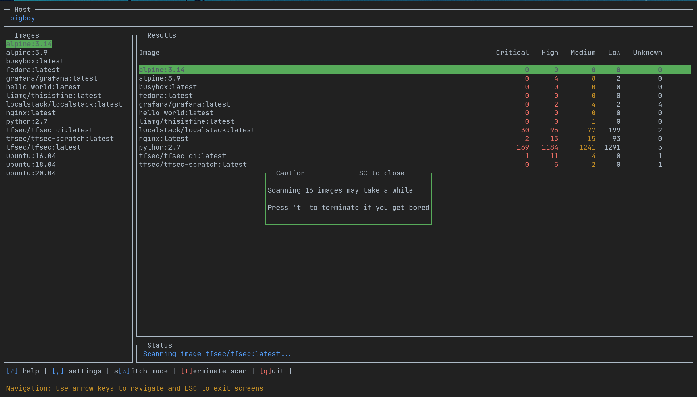

[](https://goreportcard.com/report/github.com/owenrumney/lazytrivy)
[](https://github.com/owenrumney/lazytrivy/releases)
[](https://github.com/owenrumney/lazytrivy/releases)

# lazytrivy

lazytrivy is a wrapper for [Trivy](https://github.com/aquasecurity/trivy) that allows you to run Trivy without
remembering the command arguments.

The idea was very heavily inspired by the superb tools from [Jesse Duffield](https://github.com/jesseduffield) (
lazydocker, lazynpm, lazygit)



## Installation

### Prerequisites

In order for lazytrivy to be cross-platform, it uses the Trivy docker image. This means that you will need to have Docker running on your machine for lazytrivy to work.

#### Install with Go

The quickest way to install if you have `Go` installed is to get the latest with `go install`

```bash
go install github.com/owenrumney/lazytrivy@latest
```

#### Download from Releases

Alternatively, you can get the latest releases from [GitHub](https://github.com/owenrumney/lazytrivy)

### Config

A config file can be added to `~/.config/lazytrivy/config.yml` to set default options.

```yaml
aws:
    accountno: "1234567890981"
    region: eu-west-1
vulnerability:
    ignoreunfixed: false
cachedirectory: /home/owen/.cache/trivy
debug: false
```

By setting `debug` to true, additional logs will be generated in `/tmp/lazytrivy.log`

## Usage

`lazytrivy` is super easy to use, just run it with the following command:

```bash
lazytrivy
```

### Scanning all local images

Pressing `a` will scan all the images that are shown in the left hand pane. On completion, you will be shown a
summary of any vulnerabilities found.

You can then scan individual images to get more details


### Scanning a specific image

Select an image from the left hand pane and press `s` to scan it. Use the left and right arrow keys to switch between
views and up down arrow keys to select an image.

Press `s` to scan the currently selected image.


### Scanning a remote image

To scan an image that is not already locally on the machine, you can use the `r` key to scan a remote image.


### Scanning an AWS Account

To scan an AWS account, you can use the `w` key to switch to AWS mode, from there you can use the `s` key to scan, it will detect any valid credentials it can.


By pressing `r` you can switch region in results you already have.
